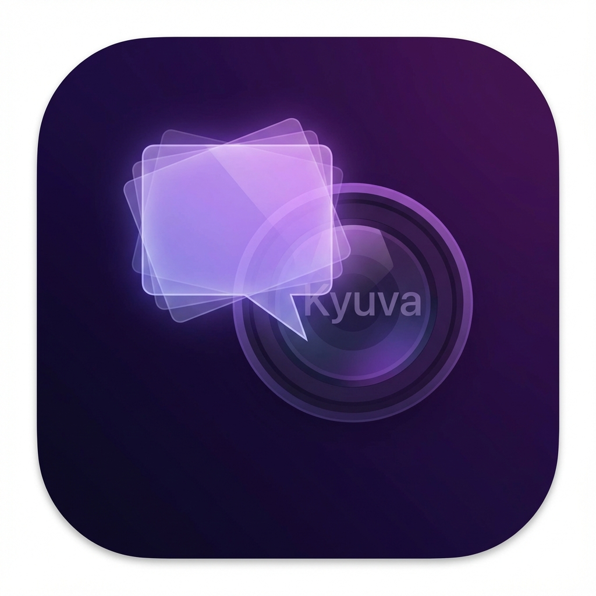

<p align="center">
  
</p>

<h1 align="center">Kyuva</h1>

<p align="center">
  <strong>Invisible camera-side prompter that follows your voice</strong>
</p>

<p align="center">
  <em>Camera cue that never leaks to screen share</em>
</p>

<p align="center">
  <a href="#features">Features</a> •
  <a href="#how-it-works">How It Works</a> •
  <a href="#installation">Installation</a> •
  <a href="#usage">Usage</a> •
  <a href="#privacy">Privacy</a>
</p>

---

## ✨ Features

- 🔒 **Invisible on Screen Share** — Overlay excluded from Zoom, Meet, Teams, OBS
- 🎤 **Voice-Follow Scrolling** — Text moves as you speak (on-device, no cloud)
- ⌨️ **Global Hotkeys** — `Shift+←/→` to adjust speed, hover to pause
- 📝 **Script Library** — Save multiple scripts, import/export txt/md
- 🚀 **Lightweight** — Native Swift, Apple Silicon optimized
- 🔐 **100% Offline** — No account, no login, no tracking

## 🎬 How It Works

1. **Position** — Kyuva sits near your camera (notch on MacBooks)
2. **Read** — Text scrolls automatically or follows your voice
3. **Stay Hidden** — Overlay is invisible when you share your screen

```
┌─────────────────────────────────┐
│  🔴 🟡 🟢      [Kyuva]          │  ← Only you see this
├─────────────────────────────────┤
│                                 │
│   Your audience sees           │
│   just your video feed         │
│   without any overlay          │
│                                 │
└─────────────────────────────────┘
```

## 📥 Installation

### Mac App Store
Coming soon — one-time purchase, lifetime updates.

### Build from Source

```bash
# Clone
git clone https://github.com/KikuAI-Lab/kyuva.git
cd kyuva

# Open in Xcode
open Kyuva.xcodeproj

# Or build with Swift
swift build
```

**Requirements:**
- macOS 13.0+
- Apple Silicon or Intel

## 🎮 Usage

| Action | Shortcut |
|--------|----------|
| Speed Up | `Shift + →` |
| Speed Down | `Shift + ←` |
| Pause | Hover over overlay |
| Toggle Voice-Follow | In Settings |

## 🔒 Privacy

**Kyuva respects your privacy:**

- ✅ All speech recognition happens **on-device**
- ✅ Scripts are stored **locally only**
- ✅ **No data** is sent to any server
- ✅ **No account** required
- ✅ **No analytics** or tracking

The microphone is used only for voice-follow scrolling and can be disabled.

## 🏗 Architecture

```
Kyuva/
├── App/           # Entry point, menu bar
├── UI/            # Overlay, Settings
├── Core/          # Script, Scroll, Voice, Hotkeys
└── Platform/      # macOS APIs (capture exclusion)
```

## 📄 License

Proprietary software. © 2026 KikuAI.

---

<p align="center">
  Made with 💜 for presenters, content creators, and anyone who wants to sound confident on camera.
</p>
