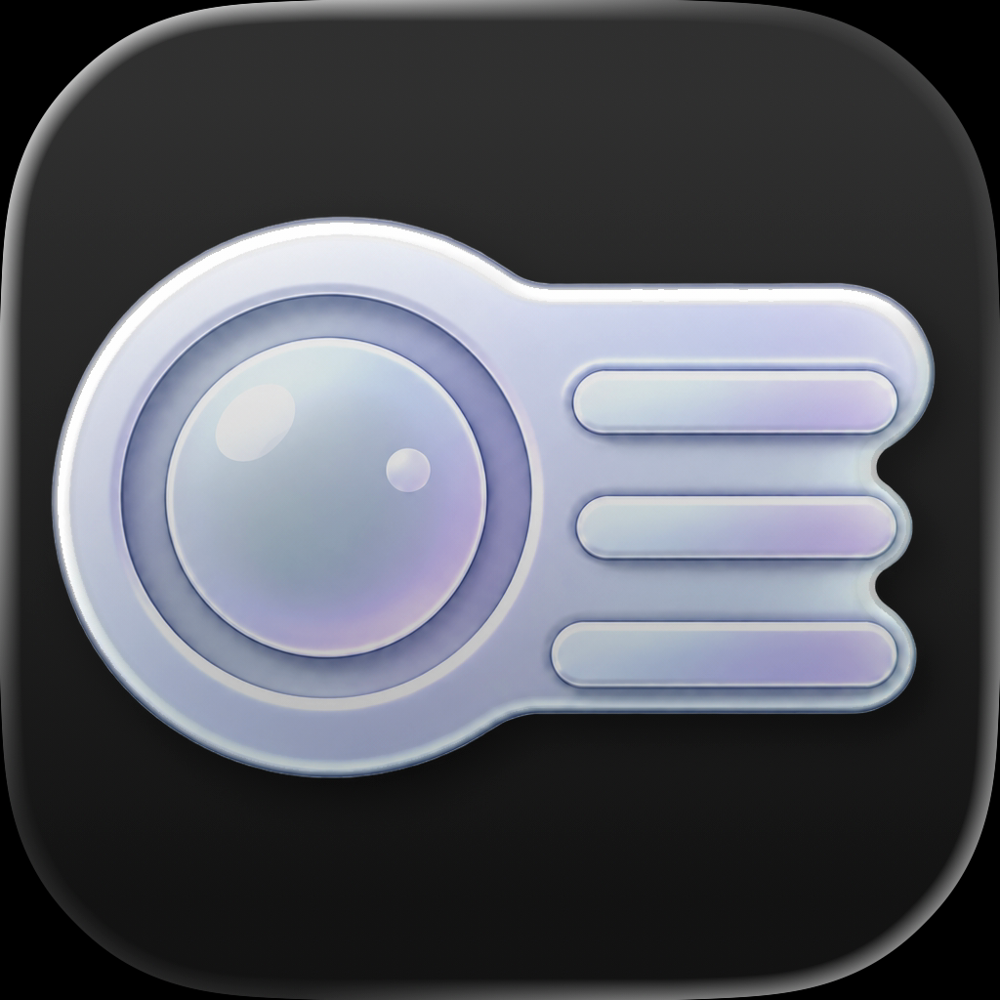

<p align="center">
  
</p>

<h1 align="center">Kyuva</h1>

<p align="center">
  <strong>Local-first macOS teleprompter with a camera-side overlay</strong>
</p>

<p align="center">
  <em>Local-first prompting near the laptop camera, with straightforward scroll controls</em>
</p>

## About

Kyuva is an open-source macOS teleprompter focused on keeping the script near the camera while you present.

### Capture visibility

The overlay is a normal macOS window and may appear in screen shares or recordings. Verify the preview before presenting, or share a single app window that omits Kyuva. Kyuva does not promise capture exclusion.

## Release Status

Kyuva is preparing a free first Mac App Store release for the 27 European Union storefronts. The first release has no purchases, subscriptions, advertising, account, analytics, or required backend. App Store availability is not claimed until the signed build, listing, and storefront state are verified.

The binary attached to the historical `v1.0.0` GitHub release is a development build, not a verified App Store distribution artifact. Build the current source until a signed and verified replacement is published.

## Feature Snapshot

- Camera-side overlay with adjustable size and appearance
- Menu command and `⌃⌥D` shortcut for cycling the overlay across connected displays
- Fixed-speed, words-per-minute, and target-duration scrolling
- Centered reading cue with progress and remaining-time feedback
- Bracketed stage-direction controls plus text-only mirroring for beam-splitter rigs
- Manual wheel/trackpad control and global shortcuts that do not request Accessibility permission
- Recoverable local script storage with import and export support
- No account, no analytics, and no required network service

## Build From Source

```bash
git clone https://github.com/kiku-jw/kyuva.git
cd kyuva
open Kyuva.xcodeproj
```

You can also try:

```bash
swift build
```

Requirements:

- macOS 13.0+
- Xcode 15+ or a compatible Swift 5.9 toolchain

Kyuva is under active release hardening. Follow [Issue #2](https://github.com/kiku-jw/kyuva/issues/2) for the macOS, iPhone, and Apple Watch delivery gates.

## Privacy

Kyuva keeps its core behavior local:

- prompting and script editing happen locally
- scripts are stored on your Mac
- no account is required
- no analytics or tracking are built in

More detail is available in [PRIVACY.md](PRIVACY.md).

## Support

See [SUPPORT.md](SUPPORT.md) for troubleshooting and the privacy-safe issue-reporting path.

## Follow the work

Project notes and new tools: [Telegram](https://t.me/kiku_ai) ·
[LinkedIn](https://www.linkedin.com/in/kiku-jw/) ·
[KikuAI](https://kikuai.dev/)

## License

This repository is released under [AGPL-3.0](LICENSE).

## Forking

Forks are welcome under the project license. Kyuva's narrow focus is camera-side prompting on macOS.

<!-- author-links:start -->
<p align="center">
  <a href="https://kikuai.dev/"></a>
  <a href="https://t.me/kiku_ai"></a>
  <a href="https://github.com/kiku-jw"></a>
</p>
<p align="center">
  <sub>Follow new projects and updates from <a href="https://github.com/kiku-jw">@kiku-jw</a>.</sub>
</p>
<!-- author-links:end -->
